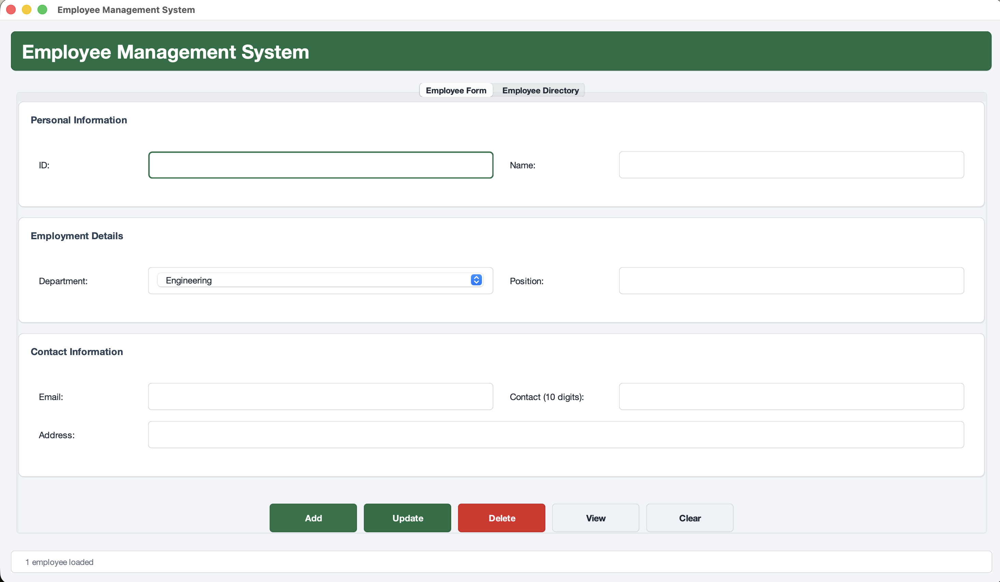
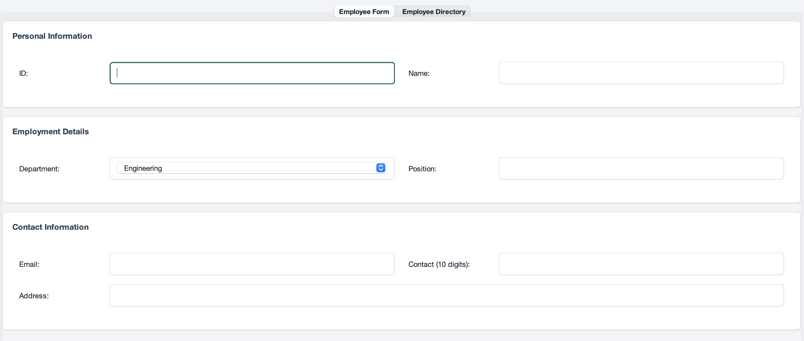

# Employee Management System

A Java Swing desktop application to manage employee records with a clean UI and CSV-based persistence.

## Features

- Full-screen UI for desktop workflows
- Employee CRUD:
  - Add
  - Update
  - Delete
  - View by employee ID
- Employee directory with searchable, sortable table
- Row-click autofill:
  - Click any row in directory
  - Employee form auto-fills for quick editing
- Inline validation messages in form area (no extra popup for common input errors)
- Validations:
  - Required fields
  - Email format
  - Contact must be 10 digits
- Duplicate employee ID prevention
- Data auto-save to `EmployeeData/employees.csv`

## Tech Stack

- Java (JDK 11+)
- Java Swing (UI)
- CSV file storage

## Project Structure

```text
src/main/java/com/employee/EmployeeFrontendUI.java
src/main/java/com/employee/EmployeeDatabase.java
src/main/java/com/employee/Employee.java
src/test/java/com/employee/CSVTest.java
EmployeeData/employees.csv
run.sh
requirements.txt
```

## Getting Started

### Prerequisites

- Java JDK 11 or higher
- `bash` or `zsh`
- Dependencies already available in `lib/`

### Quick Run

```bash
cd "/Users/ankit/Documents/Coding Project/EmployeeManagementSystem" && chmod +x run.sh && ./run.sh
```

### Standard Run

```bash
chmod +x run.sh
./run.sh
```

`run.sh` workflow:
1. Compile all Java sources from `src/main/java`
2. Start `com.employee.EmployeeFrontendUI`
3. If GUI is unavailable, run `CSVTest` as fallback

### Manual Compile and Run

```bash
mkdir -p build/classes
javac -cp "lib/*" -d build/classes $(find src/main/java -name "*.java")
java -cp "build/classes:lib/*" com.employee.EmployeeFrontendUI
```

## Usage

1. Open `Employee Form` tab.
2. Enter details and use Add/Update/Delete/View/Clear actions.
3. Open `Employee Directory` tab for filtering and browsing.
4. Click a row in directory to autofill form for quick edits.

## Screenshots

Store screenshots in `docs/screenshots/` and keep these links updated.

```text
docs/screenshots/
├── dashboard.png
├── employee-form.png
└── employee-directory.png
```

### UI Preview





## Roadmap

- [x] Core employee CRUD operations
- [x] Search + directory table
- [x] Row-click autofill for edit flow
- [x] Inline validation messages
- [ ] Edit directly from selected directory row using a dedicated "Edit Selected" action
- [ ] Export/Import employees (CSV/Excel)
- [ ] SQLite storage option (replace or complement CSV)
- [ ] Authentication and role-based access
- [ ] CI pipeline for build and tests
- [ ] Packaged desktop release (`.jar` / app bundle)

## Version Changelog

| Version | Date | Highlights |
| --- | --- | --- |
| v1.2.0 | 2026-02-14 | Added row-click autofill from directory to form; added inline form validation/status messages; improved edit workflow. |
| v1.1.0 | 2026-02-14 | Refined UI styling, improved table experience, cleaned header/status presentation. |
| v1.0.0 | 2026-02-14 | Initial release with employee CRUD, search filters, and CSV persistence. |

## Data Storage

- Primary data file: `EmployeeData/employees.csv`
- Backup strategy: copy this file periodically before major updates

## Notes

- This is not a Python project.
- `requirements.txt` is informational only, not for `pip install`.
